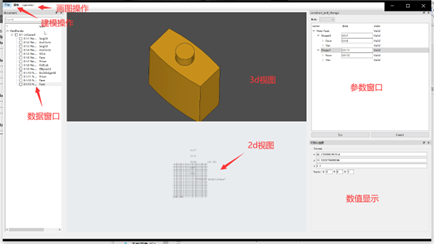

#### effect




####  要求


运行工具: miniconda

在当前文件夹下:

从 YAML 文件 创建运行环境:

```shell
conda env create -f environment.yml [-n envname]

```

#### 运行

当前文件夹下:

```sh
conda activate envname
python main.py
```


#### 使用说明

1. 新建文件

   click 开始 -> New -> xml

2. 新建Shape

   click 建模选单

3. 查看DataShape

   doubleclick  document 框的树形节点

4. 保存为pickle, 读取pickle


#### github 地址

https://github.com/nochat1205/RedPanda


#### 戒律

1. DisplayShape(selector.activate) 似乎无法解析curve parameter (nan, nan)
2. Geom_Surface.bounds 可能为(infinite, infinite, infinite, infinite), `BRepBuilderAPI_NurbsConvert`可以解决问题
